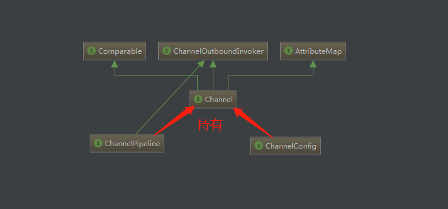
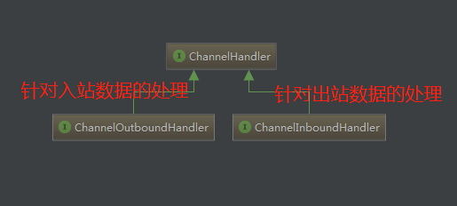
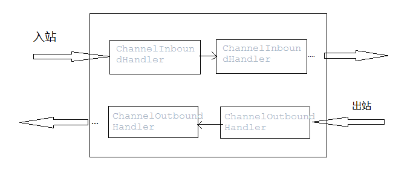

# netty架构概念说明

## Channel说明
先说一下Channel有多种类型，banding服务端口的ServerChannel,LocalServerChannel(jvm内部交互的)，NioSocketChannel(Socket通信的)等等。那么Channel除了这里说的具体实现外，人家还有什么重要的属性呢。如下图所示：

每个Channel都持有一个Config(配置)，还有一个就是ChannelPipleLine（用于处理Channel内部传输的数据Handler链表）。

## ChannelHandler与ChannelPipeLine
ChannelPipeline持有ChannelHandler列表，以责任链的模
ChannelHandler 入站从头到尾（？ extends ChannelInboundHandler），出站是从尾到头(? extends ChannelOutboundHandler)，而且事件传递是与事件相关的，如果是入站的那么只会传递个ChannelInBoundHandler的相关实现Handler，出站同理。
## ChannelHandlerContext与ChannelPipeline Channel之间的关系
其实是ChanelPipeLine每次添加ChannelHandler就会创建一个ChannelHandlerContext，context与ChannelHandler是一对一的banding关系。当然可以理解为ChannelHandlerContext是ChannelPipeline和Channel的桥梁（即Channel与Handler之间做关联），context操作事件会传递给下一个ChannelHandler。（后续在看）。
## EventLoop(暂时还没看相关的内容？)
EventLoop对注册到之上的Channel的整个生命周期的Io事件负责。
另我们知道Future是线程结果的占位符，那么ChannelFuture就是执行操作结果的占位符，两者的共同点都是异步的，但是ChannelFuture的结果是通过监听器进行回调的。
Channel ChannelHandler ChannelHandlerPipleline 

ChanelHandler的类结构 主要是适配器来减少代码的编写。因为有默认的实现可以让你关注与你需要关注的事件上。

## 引导器
|引导器类型|说明
|--|--
|BootStrap|客户端引导器 旨在连接远程服务商
|ServerBootStrap|服务端引导器 用于绑定本地端口 并接受远程客户端请求

# netty api 解析
Netty的线程模型
　　Netty的线程模型并不是一成不变的，它实际取决于用户的启动参数配置。Netty的多线程编程最佳实践如下
              
         1:创建两个NioEventLoopGroup，用于逻辑隔离NIO Acceptor和NIO I/O线程。
         2:尽量不要在ChannelHandler中启动用户线程（解码后用于将POJO消息派发到后端业务线程的除外）。
         3:如果业务逻辑操作非常简单，没有复杂的业务逻辑计算，没有可能会导致线程被阻塞的磁盘操作、数据库操作、网路操作等，可以直接在NIO线程上完成业务逻辑编排，不需要切换到用户线程。
         4:如果业务逻辑处理复杂，不要在NIO线程上完成，建议将解码后的POJO消息封装成Task，派发到业务线程池中由业务线程执行，以保证NIO线程尽快被释放，处理其他的I/O操作

## EventLoopGroup
//创建两个NioEventLoopGroup，用于逻辑隔离NIO Acceptor和NIO I/O线程。
   EventLoopGroup bossGroup = new NioEventLoopGroup(); /
    EventLoopGroup workerGroup = new NioEventLoopGroup()
## ChannelFuture
    ChannelFuture f = b.bind(port).sync(); /
    //ChannelFuture，用于在执行异步操作的时候使用。
ChannelFuture提供了几种额外的方法，这些方法使得我们能够注册一个或者多个
ChannelFutureListener实例。监听器的回调方法operationComplete()， 将会在对应的
操作完成时被调用
f.channel().closeFuture().sync();

即closeFuture()是开启了一个channel的监听器，负责监听channel是否关闭的状态，如果未来监听到channel关闭了，子线程才会释放，syncUninterruptibly()让主线程同步等待子线程结果。
##  serverBootstrap.group().childHandler
1：设置编码解码
2：设置handlder
Netty中的ChannelHandler主要由两种类型，ChannelInboundHandler和ChannelOutboundHandler

### ChannelHandler 说明

最重要的类层次结构如上，至于其他的Handler其实大部分是Adapt适配器，因为有了默认实现可以让我们少些代码，关注我们自己关注的方法即可。

另外ChannelHandler本身对入站及出站数据 是按照Handler的类型按责任链模式挨个遍历的。如下图所示：

###  ChannelInboundHandler
当查询到Java NIO底层Channel的就绪事件时，通过一系列的ChannelInboundHandler处理器，完成底层就绪事件的处理。
入站（inbound）处理通常由底层Java NIO channel触发，主要事件如下：
    
    1. 注册事件 fireChannelRegistered。
    2. 连接建立事件 fireChannelActive。
    3. 读事件和读完成事件 fireChannelRead、fireChannelReadComplete。
    4. 异常通知事件 fireExceptionCaught。
    5. 用户自定义事件 fireUserEventTriggered。
    6. Channel 可写状态变化事件 fireChannelWritabilityChanged。
    7. 连接关闭事件 fireChannelInactive。
###  ChannelOutboundHandler
当需要Netty Channel需要操作Java NIO底层Channel时，通过一系列的ChannelOutboundHandler处理器，完成底层操作。主要操作如下：

    1. 端口绑定bind。
    2. 连接服务端 connect。
    3. 写事件 write。
    4. 刷新时间 flush。
    5. 读事件 read。
    6. 主动断开连接 disconnect。
    7. 关闭 channel 事件 close。
  
   server 端handler类 实现ChannelInboundHandlerAdapter，要实现的主要接口
            
       //服务端监听到客户端活动
    void channelActive(ChannelHandlerContext ctx) throws Exception;
    //服务端监听到客户端不活动
    void channelInactive(ChannelHandlerContext ctx) throws Exception;
    //每当从服务端读到客户端写入信息时，将信息转发给其他客户端的 Channel。
    void channelRead(ChannelHandlerContext ctx, Object msg) throws Exception;
    void channelReadComplete(ChannelHandlerContext ctx) throws Exception;
    //每当从服务端收到新的客户端连接时，客户端的 Channel 存入ChannelGroup列表中，并通知列表中的其他客户端 Channel
    void handlerAdded(ChannelHandlerContext ctx) throws Exception
    //每当从服务端收到客户端断开时，客户端的 Channel 移除 ChannelGroup 列表中，并通知列表中的其他客户端 Channel
    void  handlerRemoved(ChannelHandlerContext ctx) throws Exception
    //事件处理方法是当出现 Throwable 对象才会被调用，即当 Netty 由于 IO 错误或者处理器在处理事件时抛出的异常时。
    void exceptionCaught(ChannelHandlerContext ctx, Throwable cause)
