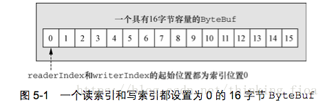

# netty架构概念说明
## Bytebuf说明
Netty 提供了ByteBuf，来替代Java NIO的 ByteBuffer ，来操纵内存缓冲区。
### java ByteBuffer 局限性如下

    1:ByteBuffer 长度固定，一旦分配完成,它的容量不能动态扩展和伸缩,当需要编码的POJO 对象大于ByteBuffer 的容量时，会发生索引越界异常
    2:ByteBuffer 只有一个标识位置的指针position,读写的时候需要手动调用flip()和rewind() 等，使用者必要小心谨慎的处理这些API,否则很容易导致程序处理失败
###  与Java NIO的 ByteBuffer 相比，ByteBuf的优势如下：

    1:Pooling (池化，这点减少了内存复制和GC，提升效率)
    2:可以自定义缓冲类型
    3:通过一个内置的复合缓冲类型实现零拷贝
    4:扩展性好，比如 StringBuffer
    5:不需要调用 flip()来切换读/写模式
    6:读取和写入索引分开
    7:方法链
    8:引用计数
###  ByteBuf的使用模式
ByteBuf维护两个不同的索引: 读索引(readerIndex)和写索引(writerIndex)。如下图: 

    1:ByteBuf维护了readerIndex和writerIndex索引,当readerIndex > writerIndex时，则抛出IndexOutOfBoundsException
    2:ByteBuf容量 = writerIndex。
    3:ByteBuf可读容量 = writerIndex - readerIndex
    4:readXXX()和writeXXX()方法将会推进其对应的索引。自动推进
    5:getXXX()和setXXX()方法将对writerIndex和readerIndex无影响

### ByteBuf的使用模式
ByteBuf本质是: 一个由不同的索引分别控制读访问和写访问的字节数组。请记住这句话。ByteBuf共有三种模式: 堆缓冲区模式(Heap Buffer)、直接缓冲区模式(Direct Buffer)和复合缓冲区模式(Composite Buffer)
1. 堆缓冲区模式(Heap Buffer)

堆缓冲区模式又称为：支撑数组(backing array)。将数据存放在JVM的堆空间，通过将数据存储在数组中实现

堆缓冲的优点: 由于数据存储在Jvm堆中可以快速创建和快速释放，并且提供了数组直接快速访问的方法
堆缓冲的缺点: 每次数据与I/O进行传输时，都需要将数据拷贝到直接缓冲区
代码:

    public static void heapBuffer() {
    // 创建Java堆缓冲区
    ByteBuf heapBuf = Unpooled.buffer(); 
    if (heapBuf.hasArray()) { // 是数组支撑
        byte[] array = heapBuf.array();
        int offset = heapBuf.arrayOffset() + heapBuf.readerIndex();
        int length = heapBuf.readableBytes();
        handleArray(array, offset, length);
    }
### 直接缓冲区模式(Direct Buffer)

Direct Buffer属于堆外分配的直接内存，不会占用堆的容量。适用于套接字传输过程，避免了数据从内部缓冲区拷贝到直接缓冲区的过程，性能较好

Direct Buffer的优点: 使用Socket传递数据时性能很好，避免了数据从Jvm堆内存拷贝到直接缓冲区的过程。提高了性能

Direct Buffer的缺点: 相对于堆缓冲区而言，Direct Buffer分配内存空间和释放更为昂贵
对于涉及大量I/O的数据读写，建议使用Direct Buffer。而对于用于后端的业务消息编解码模块建议使用Heap Buffer
代码:

    public static void directBuffer() {
    ByteBuf directBuf = Unpooled.directBuffer();
    if (!directBuf.hasArray()) {
        int length = directBuf.readableBytes();
        byte[] array = new byte[length];
        directBuf.getBytes(directBuf.readerIndex(), array);
        handleArray(array, 0, length);
    }
    }
### 复合缓冲区模式(Composite Buffer)

Composite Buffer是Netty特有的缓冲区。本质上类似于提供一个或多个ByteBuf的组合视图，可以根据需要添加和删除不同类型的ByteBuf。

想要理解Composite Buffer，请记住：它是一个组合视图。它提供一种访问方式让使用者自由的组合多个ByteBuf，避免了拷贝和分配新的缓冲区。
Composite Buffer不支持访问其支撑数组。因此如果要访问，需要先将内容拷贝到堆内存中，再进行访问

代码:

     public static void byteBufComposite() {
    // 复合缓冲区，只是提供一个视图
    CompositeByteBuf messageBuf = Unpooled.compositeBuffer();
    ByteBuf headerBuf = Unpooled.buffer(); // can be backing or direct
    ByteBuf bodyBuf = Unpooled.directBuffer();   // can be backing or direct
    messageBuf.addComponents(headerBuf, bodyBuf);
    messageBuf.removeComponent(0); // remove the header
    for (ByteBuf buf : messageBuf) {
        System.out.println(buf.toString());
    }
    }

## Channel说明
先说一下Channel有多种类型，banding服务端口的ServerChannel,LocalServerChannel(jvm内部交互的)，NioSocketChannel(Socket通信的)等等。那么Channel除了这里说的具体实现外，人家还有什么重要的属性呢。如下图所示：

每个Channel都持有一个Config(配置)，还有一个就是ChannelPipleLine（用于处理Channel内部传输的数据Handler链表）。

## ChannelHandler与ChannelPipeLine
ChannelPipeline持有ChannelHandler列表，以责任链的模
ChannelHandler 入站从头到尾（？ extends ChannelInboundHandler），出站是从尾到头(? extends ChannelOutboundHandler)，而且事件传递是与事件相关的，如果是入站的那么只会传递个ChannelInBoundHandler的相关实现Handler，出站同理。
## ChannelHandlerContext与ChannelPipeline Channel之间的关系
其实是ChanelPipeLine每次添加ChannelHandler就会创建一个ChannelHandlerContext，context与ChannelHandler是一对一的banding关系。当然可以理解为ChannelHandlerContext是ChannelPipeline和Channel的桥梁（即Channel与Handler之间做关联），context操作事件会传递给下一个ChannelHandler。（后续在看）。
## EventLoop(暂时还没看相关的内容？)
EventLoop对注册到之上的Channel的整个生命周期的Io事件负责。
另我们知道Future是线程结果的占位符，那么ChannelFuture就是执行操作结果的占位符，两者的共同点都是异步的，但是ChannelFuture的结果是通过监听器进行回调的。
Channel ChannelHandler ChannelHandlerPipleline 

ChanelHandler的类结构 主要是适配器来减少代码的编写。因为有默认的实现可以让你关注与你需要关注的事件上。

## 引导器
|引导器类型|说明
|--|--
|BootStrap|客户端引导器 旨在连接远程服务商
|ServerBootStrap|服务端引导器 用于绑定本地端口 并接受远程客户端请求

# netty api 解析
Netty的线程模型
　　Netty的线程模型并不是一成不变的，它实际取决于用户的启动参数配置。Netty的多线程编程最佳实践如下
              
         1:创建两个NioEventLoopGroup，用于逻辑隔离NIO Acceptor和NIO I/O线程。
         2:尽量不要在ChannelHandler中启动用户线程（解码后用于将POJO消息派发到后端业务线程的除外）。
         3:如果业务逻辑操作非常简单，没有复杂的业务逻辑计算，没有可能会导致线程被阻塞的磁盘操作、数据库操作、网路操作等，可以直接在NIO线程上完成业务逻辑编排，不需要切换到用户线程。
         4:如果业务逻辑处理复杂，不要在NIO线程上完成，建议将解码后的POJO消息封装成Task，派发到业务线程池中由业务线程执行，以保证NIO线程尽快被释放，处理其他的I/O操作

## EventLoopGroup
//创建两个NioEventLoopGroup，用于逻辑隔离NIO Acceptor和NIO I/O线程。
   EventLoopGroup bossGroup = new NioEventLoopGroup(); /
    EventLoopGroup workerGroup = new NioEventLoopGroup()
## ChannelFuture
    ChannelFuture f = b.bind(port).sync(); /
    //ChannelFuture，用于在执行异步操作的时候使用。
ChannelFuture提供了几种额外的方法，这些方法使得我们能够注册一个或者多个
ChannelFutureListener实例。监听器的回调方法operationComplete()， 将会在对应的
操作完成时被调用
f.channel().closeFuture().sync();

即closeFuture()是开启了一个channel的监听器，负责监听channel是否关闭的状态，如果未来监听到channel关闭了，子线程才会释放，syncUninterruptibly()让主线程同步等待子线程结果。
##  serverBootstrap.group().childHandler
1：设置编码解码
2：设置handlder
Netty中的ChannelHandler主要由两种类型，ChannelInboundHandler和ChannelOutboundHandler

### ChannelHandler 说明

最重要的类层次结构如上，至于其他的Handler其实大部分是Adapt适配器，因为有了默认实现可以让我们少些代码，关注我们自己关注的方法即可。

另外ChannelHandler本身对入站及出站数据 是按照Handler的类型按责任链模式挨个遍历的。如下图所示：

###  ChannelInboundHandler
当查询到Java NIO底层Channel的就绪事件时，通过一系列的ChannelInboundHandler处理器，完成底层就绪事件的处理。
入站（inbound）处理通常由底层Java NIO channel触发，主要事件如下：
    
    1. 注册事件 fireChannelRegistered。
    2. 连接建立事件 fireChannelActive。
    3. 读事件和读完成事件 fireChannelRead、fireChannelReadComplete。
    4. 异常通知事件 fireExceptionCaught。
    5. 用户自定义事件 fireUserEventTriggered。
    6. Channel 可写状态变化事件 fireChannelWritabilityChanged。
    7. 连接关闭事件 fireChannelInactive。
###  ChannelOutboundHandler
当需要Netty Channel需要操作Java NIO底层Channel时，通过一系列的ChannelOutboundHandler处理器，完成底层操作。主要操作如下：

    1. 端口绑定bind。
    2. 连接服务端 connect。
    3. 写事件 write。
    4. 刷新时间 flush。
    5. 读事件 read。
    6. 主动断开连接 disconnect。
    7. 关闭 channel 事件 close。
  
   server 端handler类 实现ChannelInboundHandlerAdapter，要实现的主要接口
            
       //服务端监听到客户端活动
    void channelActive(ChannelHandlerContext ctx) throws Exception;
    //服务端监听到客户端不活动
    void channelInactive(ChannelHandlerContext ctx) throws Exception;
    //每当从服务端读到客户端写入信息时，将信息转发给其他客户端的 Channel。
    void channelRead(ChannelHandlerContext ctx, Object msg) throws Exception;
    void channelReadComplete(ChannelHandlerContext ctx) throws Exception;
    //每当从服务端收到新的客户端连接时，客户端的 Channel 存入ChannelGroup列表中，并通知列表中的其他客户端 Channel
    void handlerAdded(ChannelHandlerContext ctx) throws Exception
    //每当从服务端收到客户端断开时，客户端的 Channel 移除 ChannelGroup 列表中，并通知列表中的其他客户端 Channel
    void  handlerRemoved(ChannelHandlerContext ctx) throws Exception
    //事件处理方法是当出现 Throwable 对象才会被调用，即当 Netty 由于 IO 错误或者处理器在处理事件时抛出的异常时。
    void exceptionCaught(ChannelHandlerContext ctx, Throwable cause)

# 看netty的疑问
Channel是管道，我们知道，ChannelPipeline是什么鬼？
ChannelPipeline是存放ChannelHandler链表结构的一个容器。Nio Channel是基于Select poll模型的，所以需要ChannelHandler来完成事件的回调处理，但是呢处理可能有多步，所以有了ChannelPipeline这个东东。

Channel出站和进站的处理Handler的顺序，还有Channel直接写与ChannelHadnlerContext写的差异点 在handle上的处理流程需要做实验
ChannelOutboundhandler 有read方法 读取更多数据，既然是出站数据为什么会有读取更多数据一说。
我们那样写加入一个Channel发生了channel转换的话，会不会出现这个要传输，同时我那个也要写回的冲突。可以通过channel.isWritable来查看。

另外ChannelOutboundHandler处理完了写出的话，最终的ChannelPromise状态是谁去填充的？这个后续可以看代码来完成。

重要记录：
ChannelHandler 的channelread，write方法要记得释放资源，因为人本身是用引用计数来处理池化的ByteBuf，如果不想处理的话可以用SimpleInboundHandlerAdapt 的channelRead0方法，因为这个类的channelread方法为您自动释放资源。关于池化请参照 第五章内容。（所以如果用了就不要存储任何指向消息的引用）。比如如果是ChannelOutBoundHandler的方法的write 消息**被消费后者被丢弃**并且没有传递给下一个ChannelOutBoundHandler,那么就有责任调用ReferenceCountUtil.release方法，如果消息叨叨了实际的传输层，那当消息被写入或者Channel被关闭时都会自动释放。（这个还没有太理解回头最好有案例补充）
关于资源是否泄露可以通过 -Dio.netty.leakDetectionLevel=ADVANCED 来进行分析。默认采样1%的数据进行分析。
